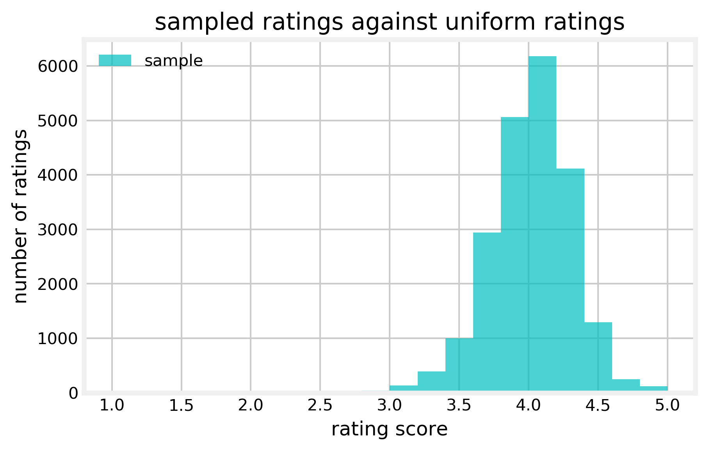

# Book Readers Are Saps!

I jokingly call book readers saps because they heavily over-rate books in the high ratings range, instead of seeming to have a scale that rates books they've read compared against one another, in a way that one would expect would create a uniform ranking. This makes choosing a book based on ratings much more challenging than choosing a resturant by rating, where a 3* resturant can be considered a middle of the road resturant...a middle of the road book seems to be 4+ in ranking from 1 to five. 
So, honestly, I'd expect something like this boy here, if humans were, as economists like to call us, rational. 

but knowing that we're not rational, heck, I'll assume that the vast majority of people are reviewing books at 4 stars, something more like this. 

The project would be, then, to correct for this lean toward a human love of books and de-rank books into a uniform distribution. 

this repository includes a system for scraping goodreads for user ratings, cleaning that data, and adjusting a rating score. 

Anyone who wonders if I fall into this same issue...well, [here's my goodreads shelf,](https://www.goodreads.com/review/list/26338733) which you can see is...primarily 4 and 5 star ratings. 
