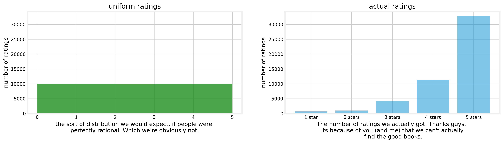
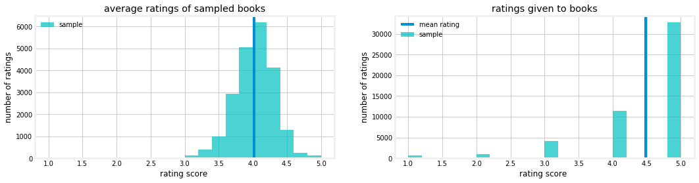

# Book Readers Are Saps!
### Goodreads user rating biass
<p align="center"> 

</p>

I jokingly call book readers saps because they heavily over-rate books in the high ratings range, instead of seeming to have a scale that rates books they've read compared against one another, in a way that create a uniform ranking. This makes choosing a book based on ratings much more challenging than choosing a resturant by rating, where a 3* resturant can be considered a middle of the road resturant...a middle of the road book seems to get more than 4 stars on average. 


I mean, seriously. Look at this. Look what we've done to this ranking system. 

<p align="left">


but knowing that we're not rational, heck, I'll assume that the vast majority of people are reviewing books at 4 stars, something more like this. 
<p align="left">

</p>

## Initial Goal
The project would be, then, to correct for this lean toward a human love of books and de-rank books into a uniform distribution. 

* Prove that book readers are saps through science,
* re-chart their ratings into a sytsem that accounts for their sappy-ness. 

this repository includes a system for scraping goodreads for user ratings, cleaning that data, and adjusting a rating score. 

# Hypothesis
Our hypothesis is that goodreads raters rate books above 4 stars more often than not. 

H0 : P(x<=4) > .5
Ha : P(x>4)>.5

# Analys methods 
Tech stack
The tech stack consists of Python 3, Numpy, Pandas, Beautiful Soup, Linguistic Inquiry and Word Count (LIWC), Natural Language Toolkit (NLTK), Scikit-Learn, Matplotlib, HTML, CSS, Tableau, Flask, and Heroku.

The tech stack consists of Python 3, Numpy, Pandas, Selenium, PyMongo, Beautiful Soup, Scikit-Learn, Matplotlib, HTML
 
scripts in src/:

```samples.py```
a script which made my 10 sample sets.

```gr_scraper.py```
a script which accesses progress.txt and samples.txt as logfiles to scrape the bookshelves of randomly chosen users on goodreads and stores it in mongodb

```gr_db_cleaner.py````
a script which does initial data cleaning and feature engineering, turning the mongo collection into a numpy array. 

Data in src/data/, the cleaned dataset
```datacln.npy```

# Results section

A t test was performed on the hypothesis, returning a t statistic of 127.2666, and a P value that rounded to 0. Its very safe to say that goodreads reviews are biassed even more than expected. 


The average rating given to books reviewed in the sample was 4.483 (plus or minus .0074 @95% confidence), and the average rating of books on goodreads, as distinct from the average rating given by a user, is 4.02 (plus or minus .004 @95% confidence)

<p align="center">

</p>
Furthermore, since the average user rating given to books is much higher than the average rating (of all user ratings) for each book, we can conclude, per Simpson's Paradox, that highly reviewed books get more ratings, and a higher porportion of 5 star ratings. This suggests that goodreads actually is working, by leading people to focus on the best books.


Anyone who wonders if I fall into this same issue...well, [here's my goodreads shelf,](https://www.goodreads.com/review/list/26338733) which you can see is...primarily 4 and 5 star ratings. 


